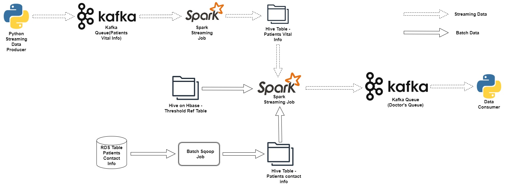

# Instant Health Alert System | Modern Data Engineering AWS Project

## Introduction :
In today's world, technology plays a vital role in every field, and similarly, our healthcare system needs to integrate with it. With the advent of IoT devices that digitize vital health data like heartbeat, blood pressure, body temperature, and more, healthcare monitoring in hospitals has faced new challenges. To address these challenges, this use case proposes a reliable data pipeline solution to store and analyze a stream of real-time data flowing from various IoT devices in hospitals and health centers. Capturing and analyzing this high-velocity stream of data in real-time with minimal error is only possible through a robust data platform and components.

## Architecture Diagram :

## Technology Used :
1. Programming Language : Python
2. Scripting Language : SQL
3. Amazon Web Services :
    - Apache Sqoop
    - Apache Pyspark
    - Apache Kafka
    - Apache Hive
    - Apache Hbase
4. Amazon SNS Service

## Dataset used :
All The data of our project will be hosted in a Centralised RDS from which we import the data. here we have 3 tables in this RDS, patient's vital info, patient_information, threshold Reference table.
1. Patient's Vital Info : have the data of IoT device which is customerId, heartbeat, bp and other details are.

    The details for this table in RDS are as follows:
    - Hostname: upgraddetest.cyaielc9bmnf.us-east-1.rds.amazonaws.com
    - username: student
    - password: STUDENT123
    - dbname: testdatabase
    - table-name: patients_vital_info
  
2. Patient Information : This table have the data of patients like, patientId, patientname, patientaddress, phone_number, admitted_ward, other_details.

   The details for this table in RDS are as follows:
    - Hostname: upgraddetest.cyaielc9bmnf.us-east-1.rds.amazonaws.com
    - username: student
    - password: STUDENT123
    - dbname: testdatabase
    - table-name: patients_information
  
3. Threshold Reference Table : This table have the data of attributes like heartbeat, bp etc with its higher and lower limits. data like attribute, Low_age_limit, high_age_limit, low_value, high_value, alert_flag, alert_message. we create this table manually in Hbase

 
  
   

 
        
         

